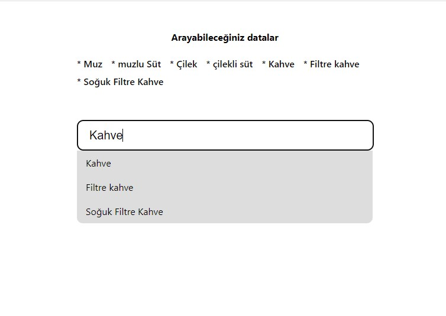

# React AutoComplate App

This autocomplete application developed using React.js is a powerful tool that allows users to search and display results quickly and efficiently. This app includes a number of libraries and techniques that have been successfully applied to enhance the user experience using modern web development technologies. 

Here is more information about the libraries you used to build this app and how they work: Depending on the React library, I used the useState, useEffect and useRef hooks.

#react #autocomplate #tutorial

